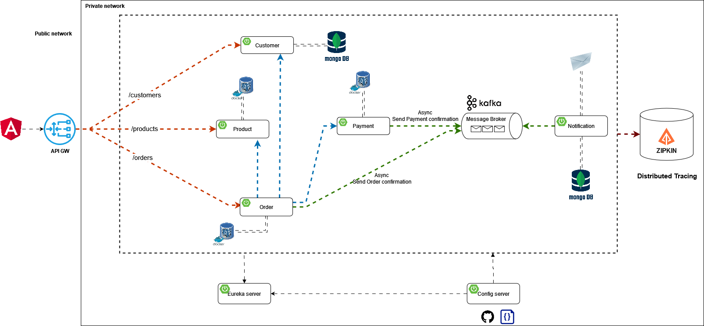

# E-Commerce Application

## Table of Contents

- [Microservices Architecture](#microservices-architecture)
- [Main Components of Microservices](#main-components-of-microservices)
- [E-Commerce Description](#e-commerce-description)
- [E-Commerce Application Architecture Overview](#e-commerce-application-architecture-overview)
- [API Gateway Service](#api-gateway-service)
- [Configuration Management Service](#configuration-management-service)
- [Service Discovery Eureka](#service-discovery-eureka)
- [Customer Service](#customer-service)
- [Product Service](#product-service)
- [Order Service](#order-service)
- [Payment Service](#payment-service)
- [Notification Service](#notification-service)

### Microservices Architecture

What is a microservice?

- Microservices are an architectural approach to develop software applications as a collection of small,
  independent services that communicate with each other over a network.
  Instead of building a monolithic application where all the functionality is tightly integrated into a single codebase,
  microservices break down the application into smaller, loosely coupled services.

How does it work?

- It's possible to break down a large and complex application into smaller, more manageable services.
  Each service is responsible for a specific business function and can be developed, deployed, and scaled independently.
- Microservices communicate with each other over a network using lightweight protocols like HTTP or messaging systems
  (for example, Apache Kafka).
  Each microservice can have an API that defines how other services can interact with it.
  It's like a contract between services.
- Microservices can be developed using different technologies and programming languages.
  This allows teams to choose the best tools for the job.
  For example, one service can be written in Java, another in Python,
  and another in Node.js and can be used different databases (PostgresSQL, MongoDB, etc...).

Benefits of microservices:

- Scalability: Microservices can be scaled independently, allowing you to allocate resources where they are necessary
  most.
- Flexibility: Microservices can be developed, deployed, and scaled independently, giving you the flexibility to adapt
  to changing requirements.
- Resilience: Microservices are isolated from each other, so a failure in one service does not bring down the entire
  system.
- Technology Diversity: Microservices allow you to use different technologies and programming languages for different
  services, giving you the freedom to choose the best tools for the job.
- Faster Development: Microservices allow teams to work on different services simultaneously, speeding up development
  time.
- Easier Maintenance: Microservices are smaller and more focused, making them easier to maintain and update.

### Main Components of Microservices:

1. Service: A microservice is a small, independent service that performs a specific business function.
2. API Gateway:
   An API gateway is a service that acts as a single entry point for clients to access multiple microservices.
   It handles routing, authentication, load balancing, and other cross-cutting concerns.
3. Service Discovery:
   This component keeps track of the locations and network addresses of all microservices in the system.
   Service discovery ensures that services can locate and communicate with each other dynamically.
4. Load Balancer:
   A load balancer distributes incoming network traffic across multiple instances of a service to ensure optimal
   performance and availability.
5. Containerization:
   Microservices are often deployed in containers, such as Docker containers, to ensure consistency and portability
   across different environments.
6. Message Broker:
   A message broker is a middleware component that enables communication between microservices using asynchronous
   messaging.
   Message brokers help decouple services and provide reliable message delivery.
7. Distributed Tracing System:
   A distributed tracing system allows you to monitor and trace requests as they flow through multiple microservices.
   This helps you identify performance bottlenecks and troubleshoot issues in a distributed system.
8. Database per Service:
   Each microservice has its own database, which helps to ensure data isolation and independence between services.
9. Configuration Management:
   Configuration management tools help you manage external properties for microservices across different environments.
   This ensures that each microservice has the correct configuration settings for its environment.

### E-Commerce Description

This is an e-commerce application that allows users to browse and purchase products.
It is built as a solution for commerce businesses that want to have an online presence.
This system is designed with domain-driven design principles in mind,
and it is built with a microservices' architecture.

E-commerce Application Features:

- Customer Management: Users can create an account, log in, and manage their profile.
- Product Management: Admins can add, update, and delete products.
- Order Management: Users can place orders, view order history, and track order status.
- Payment Management: Users can make payments for their orders.
- Notification Management: Users receive notifications about their orders.

E-commerce Application Microservices:

- Customer Service: Manages customer data and provides customer-related operations.
- Product Service: Manages product data and provides product-related operations.
- Order Service: Manages order data and provides order-related operations.
- Payment Service: Manages payment data and provides payment-related operations.
- Notification Service: Manages notification data and provides notification-related operations.

### E-Commerce Application Architecture Overview:

General Information:

- Docker: A containerization platform that allows you to package applications and dependencies into containers.
  All databases and other external services are running in Docker containers. This ensures the consistency and
  portability of
  The containers are managed by Docker Compose, which has all properties to build it.
- Lombok: A library that helps reduce boilerplate code in Java applications. It's used in all microservices.

### API Gateway Service

The API Gateway is the entry point for clients to access the microservices
(customer service, order service and product service).
It handles routing, authentication, and load balancing.
The API Gateway uses OAuth2.0 protocol to secure each service route.
The client must get a valid access token through **Keycloak**.

Technologies used:

- Spring Cloud Gateway: An API Gateway built on top of Spring WebFlux.
- Keycloak: An open-source identity and access management solution.
- OAuth2.0: An authorization framework that enables secure access to resources.

### Configuration Management Service

The Configuration Management Service is responsible for managing microservices properties including API Gateway and
Eureka server.
It ensures that each microservice has the correct configuration settings for its environment.
The Configuration Management Service uses **Spring Cloud Config** to store and manage configuration properties in a
centralized repository.

Technologies used:

- Spring Cloud Config: A tool for managing external properties for microservices.

### Service Discovery Eureka

The Service Discovery component keeps track of the locations and network addresses of all microservices in the system.
This server has the responsibility of registering the services and providing the registry to the clients.
The Service Discovery component uses **Eureka** to register and discover microservices.
Each microservice is a client of the Eureka server.

Technologies used:

- Spring Cloud Netflix Eureka: A service registry and discovery server.

### Customer Service

The Customer Service is responsible for managing customer data and providing customer-related operations.
This service provides an API for customer management operations.
There are two types of communication:

- private communication between customer service and other services
- public network through API Gateway, which is an OAuth 2.0 secured route.

Customer Service Operations:

- Create a new customer account.
- Update customer information.
- Get customer information by ID.
- Get all customers.
- Delete a customer account.

Technologies used:

- MongoDB: A NoSQL database for storing customer data.
- Spring Data MongoDB: A Spring Data module for MongoDB integration.

### Product Service

The Product Service is responsible for managing product data and providing product-related operations.
This service provides an API for product management operations.
The list of products was created previously and stored in the database using database migration.
There are two types of communication:

- private communication between product service and other services
- public network through API Gateway, which is an OAuth 2.0 secured route.

Product Service Operations:

- Add a new product.
- Get product information by ID.
- Get all products.

Technologies used:

- PostgreSQL: A relational database for storing product data.
- Spring Data JPA: A Spring Data module for JPA integration.
- Flyway: A database migration tool for managing database schema changes.

### Order Service

The Order Service is responsible for managing order data and providing order-related operations.
This service provides an API for order management operations.
There are two types of communication:

- private communication between order service and other services
- public network through API Gateway, which is an OAuth 2.0 secured route.

The order service communicates with the customer service, product service,
payment service and notification service using the API they provide.
The service communicates internally with the customer to get the customer information.
The product service is used to get all products, and the payment service is used to make the payment.
After these steps,
the order service communicates with the notification service
to send a notification to inform the customer of the order confirmation using message broker.

Order Service Operations:

- Create a new order.
- Get order information by ID.
- Get all orders.

Technologies used:

- PostgresSQL: A relational database for storing order data.
- Spring Data JPA: A Spring Data module for JPA integration.
- RestTemplate: A Spring module for making HTTP requests.
- Feign: A declarative web service client.
- Apache Kafka as producer: A distributed streaming platform for building real-time data pipelines.

### Payment Service

The Payment Service is responsible for managing payment data and providing payment-related operations.
This service provides an API for payment management operations.
There are two types of communication:

- private communication between payment service and other services
- public network through API Gateway, which is an OAuth 2.0 secured route.

The payment service communicates with the order service to create the payment and communicate with the notification
to send a notification to notify the customer that payment was a success using message broker.

Payment Service Operations:

- Create a new payment.
- Get payment information by ID.

Technologies used:

- PostgresSQL: A relational database for storing payment data.
- Spring Data JPA: A Spring Data module for JPA integration.
- Apache Kafka as consumer: A distributed streaming platform for building real-time data pipelines.

### Notification Service

The Notification Service is responsible for managing notification data and providing notification-related operations.
This service doesn't provide an API for notification management operations. 
It communicates with the order service and payment service through a message broker.
The service listens to messages that came from the broker and after receiving it,
the notification service will send a message to the customer by email.
There exist only two types of messages: order confirmation and payment confirmation.
The service stores the notification data in the database.

Technologies used:

- MongoDB: A NoSQL database for storing notification data.
- Spring Data MongoDB: A Spring Data module for MongoDB integration.
- Apache Kafka as consumer: A distributed streaming platform for building real-time data pipelines.
- Spring Mail: A Spring module for sending email messages.
- Thymeleaf: A Java template engine for processing and creating HTML, XML, JavaScript, and text.

### Zipkin

Zipkin is a distributed tracing system that helps you monitor and troubleshoot microservices-based applications.
It provides insights into how requests flow through your system and helps you identify performance bottlenecks and
troubleshoot issues.
Zipkin is used to trace requests as they flow through the microservices in the e-commerce application.
Each microservice sends trace data to Zipkin, which aggregates and displays the trace data in a user-friendly format.